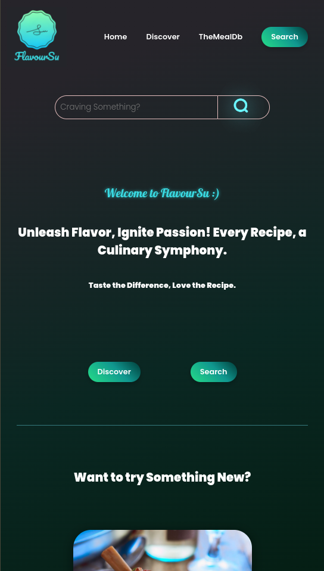
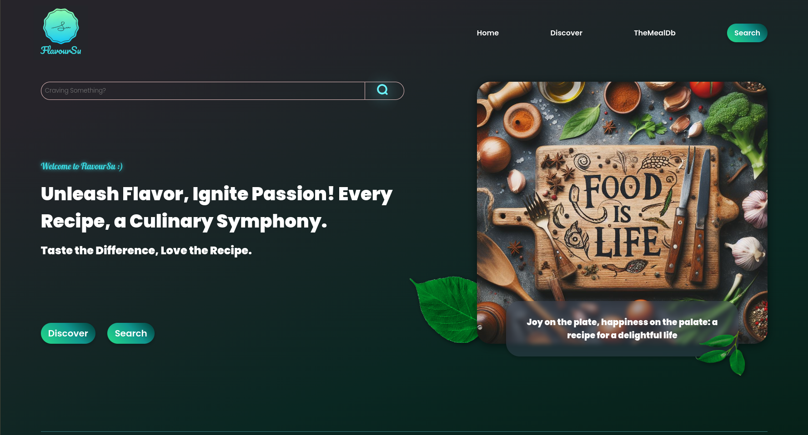

# FlavourSu

Welcome to flavourSu, a recipe website that brings a variety of flavors to your kitchen. Explore and try out new recipes with ease!

## Table of Contents

- [About](#about)
- [Demo](#demo)
- [Features](#features)
- [Technologies Used](#technologies-used)
- [ScreenShots](#screenshots)

## About

The name "flavourSu" reflects the silent 'u' at the end, emphasizing the focus on diverse flavors. FlavourSu is a recipe website that utilizes "theMealDb" API to provide users with a diverse collection of recipes. The user-friendly interface makes it easy to discover, search, and save your favorite recipes.

## Demo

Check out the live demo: [flavourSu](https://sujal-shresth.github.io/flavourSu/)

GitHub Repo link: [FlavourSu Repo](https://github.com/Sujal-Shresth/flavourSu)

## Features

- **Recipe Catalog:** Browse a vast catalog of recipes sourced from "theMealDb" API.
- **Search Functionality:** Search for specific recipes based on ingredients or names.
- **Responsive Design:** Enjoy a seamless experience on various devices with a responsive design.
- **Figma Design:** The user interface design was created using Figma for a visually appealing experience.

## Technologies Used

- HTML
- CSS
- JavaScript
- [theMealDb API](https://www.themealdb.com/api.php)
- Figma (for design)

## Credits

- **Design:** The user interface design was created using Figma.

- **Data:** Recipe data is sourced from [theMealDb](https://www.themealdb.com/).

## ScreenShots

